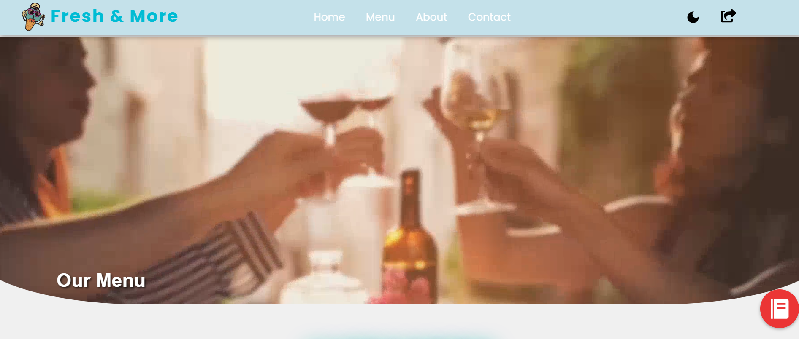

<h2 align="center">

 
  <a href="https://freshandmore-two.vercel.app/" target="_blank">Fresh & More</a>
</h2>

  

<h1 align="center" style="font-size: 3em;">Fresh & More Café ☕🍽️</h1>

  Welcome to the official website of <strong>Fresh & More</strong>! A modern café landing page with an integrated digital menu. Featuring pages for <strong>Home</strong>, <strong>About</strong>, <strong>Menu</strong>, and <strong>Contact</strong>, designed with <strong>responsiveness</strong> and <strong>interactivity</strong> in mind for both mobile and desktop users.

 

 &nbsp;
 &nbsp;
 &nbsp;
 &nbsp;

                

<h3 align="center">
    🔹
    <a href="https://github.com/Amol5766/M1/issues/new">💡 Submit an Issue</a> &nbsp; &nbsp;
    🔹
    <a href="https://github.com/Amol5766/M1/pulls">🚀 Request a Feature</a>
</h3>

## TL;DR

You can fork this repo to modify and make changes of your own. Please give me proper credit by linking back to [Amol5766](https://github.com/Amol5766/Eye-hospital). Thanks!

## 📝 Project Overview

The **Fresh & More** website is a comprehensive, responsive café landing page that showcases a dynamic and interactive menu, with sections for **Home**, **About**, **Menu**, and **Contact**. Built using **React**, **Vite**, and **CSS**, it provides a seamless experience on both mobile and desktop devices.

<h2>🌟 Features</h2>

  
  ▶ 📋 **Interactive Digital Menu**: View hidden animations and hover effects as you browse our selections. 
  
  ▶ 📱 **Responsive Design**: Optimized for both mobile and desktop to offer a seamless experience. 
  
  ▶ 🖼️ **Beautiful Animations**: Includes subtle, hidden animations on the menu page for engaging user interaction. 
  
  ▶ 👨‍💻 **Multiple Sections**: Features a landing page, About, Contact, and an interactive menu. 
  

<h2>⚙️ Installation Instructions</h2>

  
  To run the **Fresh & More** project locally, follow these steps:
  

<pre style="background: #f9f9f9; border-radius: 5px; padding: 10px;">
# Clone the repository
git clone https://github.com/Amol5766/M1.git

# Navigate to the project directory
cd M1

# Install dependencies
npm install

# Start the development server
npm run dev
</pre>

  This will start the project using Vite for a fast and optimized development experience.

<h2>🚀 Usage</h2>

  
  The **Fresh & More** website provides an intuitive digital experience, allowing users to:
  

  
  ▶ 🛠️ **Explore Menu**: View detailed, animated descriptions of available dishes and drinks. 
  
  ▶ 📞 **Contact Us**: Easy-to-navigate contact page for inquiries. 
  
  ▶ 🔍 **About Us**: Learn about the café's story and vision. 
  
  ▶ 🖥️ **Navigate Pages**: Switch seamlessly between pages like Home, Menu, About, and Contact.

## 🛠️ Technologies and Tools Used:

  
   

<h2>🖋 License</h2>

  This project is licensed under the <strong>MIT License</strong>. Feel free to use and contribute!

<h2>🙌 Contribute</h2>

  I welcome contributions to enhance the <strong> Fresh & More </strong> project! If you’d like to report a bug, suggest improvements, or contribute code, I’d love to hear from you.

Made with ❤️ by <strong>Amol</strong> @ <strong>Fresh & More</strong>.

<h2>📧 Questions?</h2>

Feel free to reach out if you have any questions or need support! I'm here to help ❤️.

